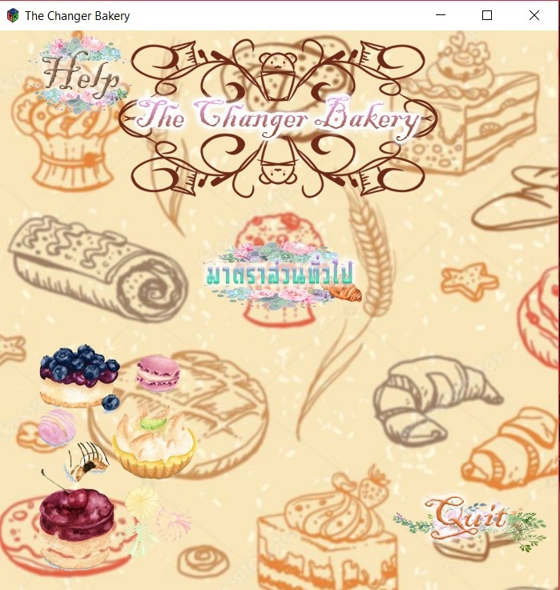
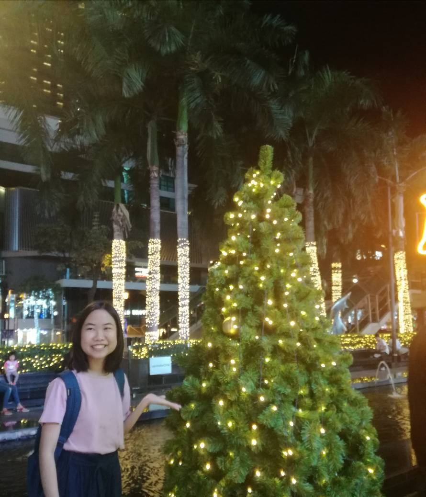

# The Changer Bakery

**VDO PROJECT :** https://www.youtube.com/watch?v=SgYDd1Y6hMg&feature=youtu.be
 **VDO DOWNLOAD GTK and compile project :** https://www.youtube.com/watch?v=1gSPtAWzJDg **จำเป็น**

## ภาษาที่ใช้
C และได้ประยุกต์ร่วมกับ Library GTK 

## ความเป็นมา
เนื่องจากว่ามีคนในกลุ่มที่ชื่นชอบการทำขนม และในการทำขนมนั้น เป็นสิ่งที่ขึ้นชื่อในด้านความถูกต้องของสูตร
การที่จะทำขนมในแต่ละอย่างได้นั้น ต้องชั่งหรือตวงวัตถุดิบให้ตรงตามสูตร แต่ในบางครั้งอุปกรณ์ก็มีอย่างจำกัดตามทุนทรัพย์ที่มี 
ทำให้เราต้องมีการ adapt กับอุปกรณ์ที่มีอยู่ให้ตรงต่อตามสูตรที่เราต้องการ เราจึงได้คิดโปรแกรมแปลงหน่วยสำหรับการแปลงหน่วยมาตราชั่ง
ในการทำขนมนี้ขึ้นมา 

## จุดประสงค์
เพื่อช่วยทำให้คนที่ชอบทำขนมแต่มีอุปกรณ์ที่ไม่พร้อมตามสูตรของขนมที่จะทำ สามารถ adapt ไปใช้ กับอุปกรณ์ที่มี ให้สามารถแปลงไปใช้ได้ตามสูตรขนมที่ต้องการ
## ขอขอบคุณ ข้อมูลจาก
https://www.facebook.com/OurKitchenThailand/posts/699496676782994
http://www.archeep.com/chemistry/chem_mt.htm?fbclid=IwAR1LdyVQqey-kFoiTxLnx4ANUXTzcVQrxwunCDQk7s4AwVQSjEyQx_2pg34

## จัดทำโดย
 |
:---:|:---:
**น.ส.มัญชรี ทยาธรรม**|**น.ส.วิลาวัณย์ ใจงามเลิศวงศ์**
61070176|61070209
[mcrrlee](https://github.com/mcrrlee)|[wirawan05595](https://github.com/wirawan05595)
|
**น.ส.อณิษฐา ใจอ่อน**|**น.ส.อัญชลี ทิพย์ประเสริฐ**
61070255|61070264
[AnitthaJai-on](https://github.com/AnitthaJai-on)|[ppllelp](https://github.com/ppllelp)
