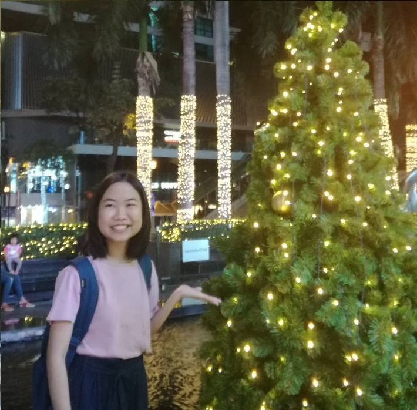
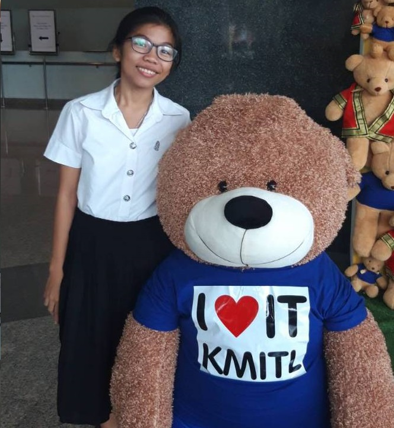

# ชื่อโปรเจค The Changer Bakery
 

## ความเป็นมา
เนื่องจากว่ามีคนในกลุ่มที่ชื่นชอบการทำขนม และในการทำขนมนั้น เป็นสิ่งที่ขึ้นชื่อ ด้านความแป๊ะของสูตร
การจะทำขนมในแต่ละอย่างได้นั้น สูตรในการทำต้องแป๊ะ แต่ในบางครั้งเราก็ไม่มี อุปกรณ์ชั่ง
ตามสูตรที่นั้นๆ ทำให้เราต้องมีการ adapt ใช้กันเกิดขึ้น เราจึงได้คิดโปรแกรมแปลงหน่วยสำหรับการแปลงหน่วยมาตรชั่ง
ในการทำขนมนี้ขึ้นมา

## จุดประสงค์
เพื่อ ช่วยทำให้คนที่ชอบทำขนมแต่อุปกรณ์ไม่พร้อมตามสูตรของขนมที่จะทำ สามารถ adapt ใช้ อุปกรณ์ที่มี ให้สามารถ
ใช้ได้ตามสูตรขนมที่ต้องการ

## จัดทำโดย
 |
:---:|:---:
**น.ส.มัญชรี ทยาธรรม**|**น.ส.วิลาวัณย์ ใจงามเลิศวงศ์**
61070176|61070209
[mcrrlee](https://github.com/mcrrlee)|[wirawan05595](https://github.com/wirawan05595)
|
**น.ส.อณิษฐา ใจอ่อน**|**น.ส.อัญชลี ทิพย์ประเสริฐ**
61070255|61070264
[AnitthaJai-on](https://github.com/AnitthaJai-on)|[ppllelp](https://github.com/ppllelp)
